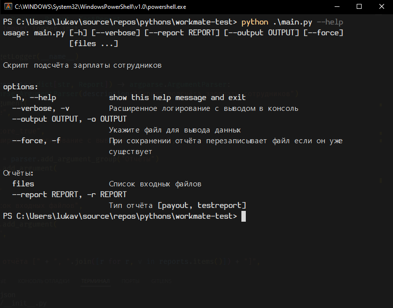
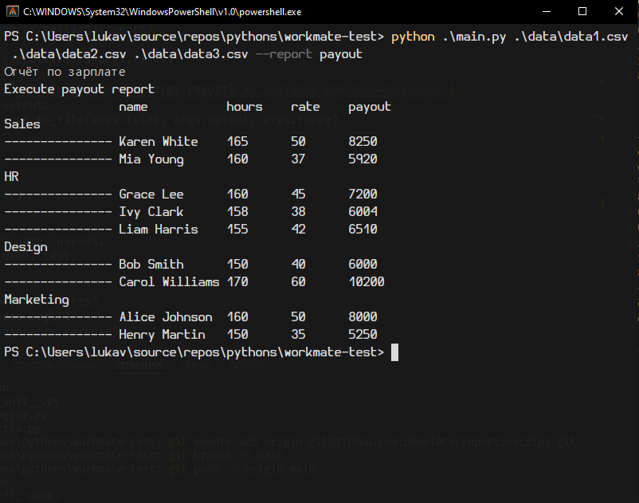
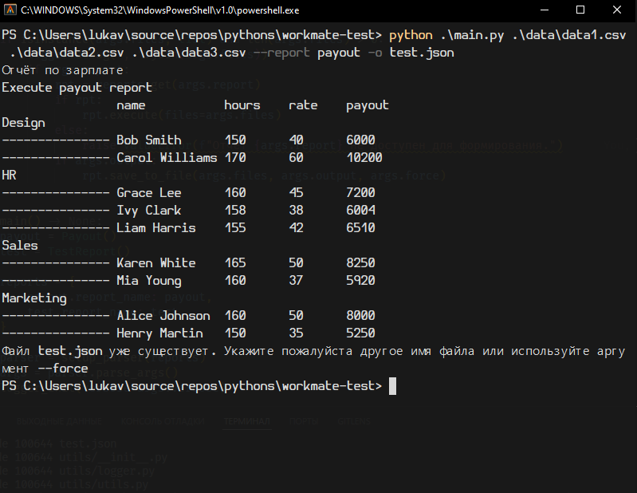
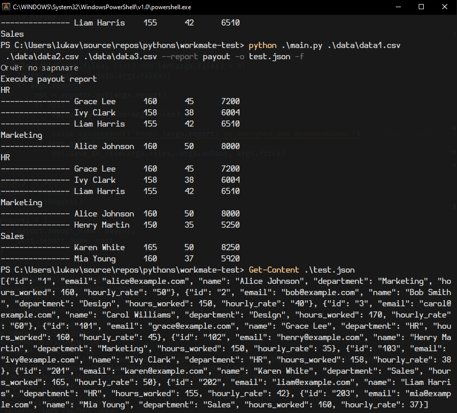
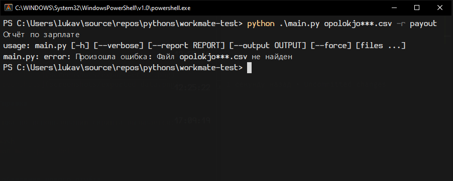

# Отчёты

## Скриншоты







## Справка

Справка по использованию скрипта вызывается:

```bash
python main.py --help
```

## Добавление нового отчёта

Для добавления нового отчёта, создать класс, реализующий интерфейс класса Report (reports/base.py), инициализировать его экземпляр и добавить в словарь reports в main.py:

```python
def main():
    payout = Payout()
    test = TestReport()

    reports = {
        payout.report_name: payout,
        test.report_name: test,
    }
```

- Report.execute() используется для вывода отчёта на печать, в нём можно использовать метод базового класса print_report() или переопределить его своей реализацией.
- Для изменения формата вывода отчёта, можно переопределить formatter() базового класса Report
- Для изменения формата вывода заголовков, можно передать свой заголовок переопределив член базового класса headers_line
- Для более глубокой переработки формата вывода отчёта, можно переопределить print_report()

Пример минимальной реализации отчёта: reports/testreport.py.
